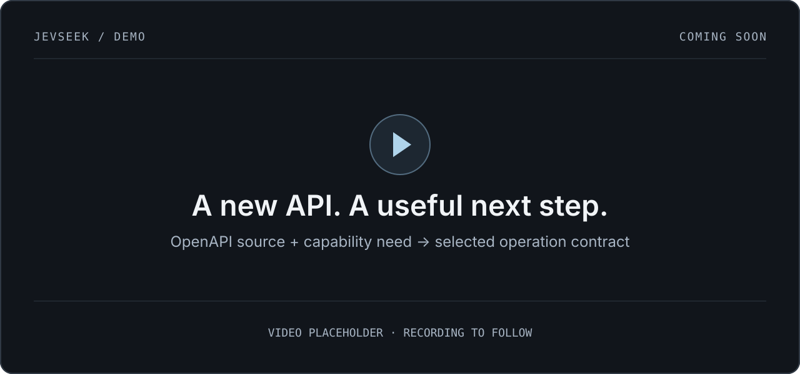

<h1 align="center">JevSeek</h1>

<p align="center">
  <strong>Find the API capability your coding agent needs.</strong><br />
  Search OpenAPI operations and remote MCP tools without loading the full catalog into context.
</p>

<p align="center">
  <a href="https://github.com/dej-h/jevseek/actions/workflows/ci.yml"></a>
  <a href="https://github.com/dej-h/jevseek/releases/latest"></a>
  <a href="https://github.com/dej-h/jevseek/blob/main/package.json"></a>
  <a href="#connect-your-agent"></a>
  <a href="https://github.com/dej-h/jevseek/blob/main/LICENSE"></a>
</p>

<p align="center">
  <a href="#get-started">Get started</a> ·
  <a href="#connect-your-agent">Connect your agent</a> ·
  <a href="#from-a-need-to-a-request">See an example</a>
</p>



JevSeek helps coding agents find their way around unfamiliar APIs and MCP servers. Give it an OpenAPI file, an HTTPS document URL, or a public remote MCP endpoint and describe what you need. It detects the source type, enumerates capabilities, uses [TypeSafe Jev](https://docs.typesafe.ai) to score their relevance, and returns selected native contracts.

Use it through the CLI, a TypeScript function, or an MCP discovery tool. No per-API wrapper or embedding index is required for discovery.

## From a need to a request

You need filenames and change metadata for a pull request. Which operation provides them, and what arguments does it require?

```bash
jevseek discover \
  "I need filenames and change metadata for a pull request" \
  ./examples/github/api.github.com.json --top 1
```

The relevant GitHub contract, summarized from the example source:

```text
GET /repos/{owner}/{repo}/pulls/{pull_number}/files

Operation:  pulls/list-files
Required:   owner, repo, pull_number
Returns:    filename, status, additions, deletions, changes, ...
```

The CLI returns JSON with ranked contracts, source pointers, reference warnings, and usage. The summary above shows the operation to look for, not a captured live run.

**JevSeek finds the contract. Your agent builds and executes the request using its existing tools.**

## Get started

Requires **Node.js 20+**, npm, and a **TypeSafe API key**. Discovery makes billed calls to TypeSafe.

Install the latest GitHub release:

```bash
npm install -g https://github.com/dej-h/jevseek/releases/latest/download/jevseek.tgz
```

Set your key and discover directly from an HTTPS OpenAPI document:

```bash
export TYPESAFE_API_KEY="your-typesafe-key"

jevseek discover \
  "I need filenames and change metadata for a pull request" \
  "https://raw.githubusercontent.com/github/rest-api-description/main/descriptions/api.github.com/api.github.com.json" \
  --top 1
```

You can also supply a local JSON/YAML file. Keep API keys out of version control.

For a public remote MCP server, use the same command with its direct HTTPS endpoint. There is no source-type flag:

```bash
jevseek discover \
  "I need to find the institutional holders of a public company" \
  https://www.oxfordledge.com/mcp \
  --top 1
```

That live run scanned 62 tools and selected `get_institutional_holders` with a score of `0.94`. The returned contract included the original input schema and this invocation breadcrumb:

```json
{
  "endpoint": "https://www.oxfordledge.com/mcp",
  "transport": "streamable-http",
  "method": "tools/call",
  "tool": "get_institutional_holders"
}
```

JevSeek also discovered `execute` from CoinGecko and `migrate_pages_to_workers_guide` from Cloudflare Docs. Across the three live runs it scanned 66 tools using four Jev requests at a total reported cost of `$0.001599318`. See the [recorded inputs and results](docs/mcp-public-discovery-evidence.md).

MCP results preserve the original tool definition and tell the agent where the capability lives. Your execution client still establishes its own connection and supplies arguments from the returned schema. JevSeek does not call the tool, share its discovery session, or grant access. Only public, unauthenticated Streamable HTTP discovery is supported. OAuth, local stdio sources, resources, and prompts are TODO.

## Connect your agent

JevSeek exposes one MCP tool: **`jevseek_discover`**. Your coding agent starts the local stdio server automatically and supplies a local OpenAPI path, HTTPS OpenAPI URL, or public remote MCP endpoint with each call. No source registration, source kind, or server restart is needed.

After installing the client, choose your agent:

<details>
<summary><strong>Codex</strong></summary>

Register JevSeek with Codex:

```bash
codex mcp add jevseek \
  --env TYPESAFE_API_KEY="$TYPESAFE_API_KEY" \
  -- jevseek serve
```

Restart Codex, then run `codex mcp list` or check `/mcp` in a CLI session.

</details>

<details>
<summary><strong>Claude Code</strong></summary>

Register JevSeek for your Claude Code user:

```bash
claude mcp add --scope user \
  --env TYPESAFE_API_KEY="$TYPESAFE_API_KEY" \
  --transport stdio jevseek \
  -- jevseek serve
```

Restart Claude Code, then check `/mcp`.

</details>

Then give your agent a real public PR URL and ask:

> Use JevSeek with the GitHub OpenAPI file at /absolute/path/github.openapi.json. I need filenames and change metadata for this pull request. Find the operation, inspect its contract, and make the public read-only request.

For an MCP catalog, the source is just the endpoint string:

```json
{
  "source": "https://www.oxfordledge.com/mcp",
  "need": "I need to find the institutional holders of a public company",
  "top_k": 1
}
```

See [coding-agent setup and troubleshooting](docs/coding-agents.md) for source restrictions, limits, and common failures.

## When to use it

- **An unfamiliar service:** you have its OpenAPI document, but no custom integration.
- **A large MCP catalog:** the server exists, but injecting every tool definition into the agent wastes context.
- **An integration gap:** your existing tools do not expose the operation you need.
- **Your own API:** discover capabilities from its specification or public MCP endpoint.

If you already know the endpoint, or an installed tool already handles the task, use that directly.

## How it works

```text
source + capability need
  → detect OpenAPI or remote MCP
  → enumerate operations or tools
  → Jev scores structured descriptors
  → return selected native contracts
```

Descriptors are compact representations sent to Jev. OpenAPI results preserve operation data and resolved local references. MCP results preserve the original tool definition and add an invocation breadcrumb. The full catalog is not returned to the coding agent.

For OpenAPI, `--parameters`, `--request-body`, and `--responses` enable richer scoring descriptors; they are off by default. MCP descriptors use the tool name, title, description, schemas, and annotations. `--top` controls the number of results. Run `jevseek --help` for command options.

<details>
<summary><strong>Use the TypeScript API</strong></summary>

Install the tarball as a project dependency with `npm install ./jevseek.tgz`:

```ts
import { discover } from "jevseek";

const result = await discover(
  "https://www.oxfordledge.com/mcp",
  "I need to find the institutional holders of a public company",
  { topK: 3 },
);
```

</details>

## Support, privacy, and limits

| Area | Current support |
| --- | --- |
| Sources | OpenAPI 3.0/3.1 JSON/YAML from local files or direct HTTPS URLs; public remote MCP tool catalogs over Streamable HTTP |
| References | Bounded local references; external references produce warnings and are not fetched |
| Interfaces | CLI, TypeScript, and stdio MCP |
| Verification | CI and isolated package-install tests on Linux with Node.js 20, 22, and 24; [three live public MCP discovery runs](docs/mcp-public-discovery-evidence.md); live agent execution is not yet verified |

The **need and descriptor content leave your machine and go to TypeSafe**. Use only specifications and catalogs you are authorized to share. By default, the JevSeek MCP server can read files and fetch HTTPS URLs accessible to its process, including internal destinations. For a restricted setup, repeat `--allow-source <file-or-url>` at startup to permit only those exact sources. See [source-access configuration](docs/coding-agents.md#optional-source-restrictions). JevSeek does not execute target operations or grant permission to do so.

Unsupported documents and provider failures produce errors. Incomplete reference closures carry warnings. Security-scheme definitions and effective parameter overrides still need work; a completeness flag is not proof that a request will succeed. MCP rejects results larger than 1 MiB rather than silently truncating contracts. [Detailed limits](docs/coding-agents.md#limits-and-verification).

## Contributing

Found a misleading match or an awkward source catalog? [Open an issue](https://github.com/dej-h/jevseek/issues) with a sanitized source, the capability need, and the expected operation or tool. Do not upload credentials or private schemas.

```bash
git clone https://github.com/dej-h/jevseek.git
cd jevseek
npm ci
npm run typecheck
npm test
npm run release:package
npm run test:package
```

Tests mock TypeSafe responses; package installation fetches dependencies from npm. These checks make no paid Jev calls.

[Design spec](docs/JevSeek_Design_Spec.md) · [Coding-agent guide](docs/coding-agents.md) · [Discovery evidence](docs/mcp-public-discovery-evidence.md) · [Releases](https://github.com/dej-h/jevseek/releases) · [MIT license](LICENSE)
